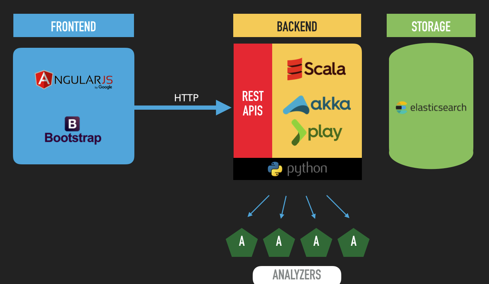
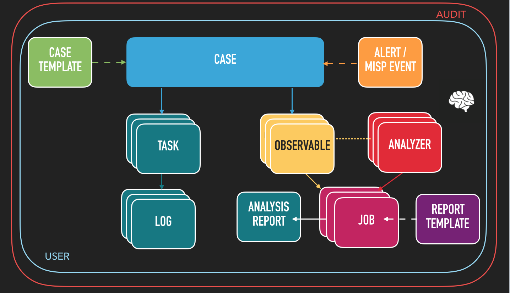

As seasoned Digital Forensics & Incident Response practitioners, we have been looking for years for a solid, scalable platform to **investigate** and **collaborate** on information security incidents, **store** heterogeneous observables and **analyze** them one by one or in bulk.

Unsatisfied with what we found on the market, development started in earnest in early 2014 and a first usable version was put in production in October 2014. **TheHive** was born and it has been used since then by about a dozen analysts on a daily basis.

# TheHive
[TheHive](https://thehive-project.org/) is a scalable 3-in-1 open source and free solution designed to make life easier for SOCs, CSIRTs, CERTs and any information security practitioner dealing with security incidents that need to be investigated and acted upon swiftly.

## Collaborate
Collaboration is at the heart of TheHive. Multiple analysts can work on the same case simultaneously. For example, an analyst may deal with malware analysis while another may work on tracking C2 beaconing activity on proxy logs as soon as IOCs have been added by their coworker, thanks to the Flow (a Twitter-like stream that keeps everyone updated on what's happening in real time).

## Elaborate
Within TheHive, every investigation corresponds to a case. Cases can be created from scratch and tasks added on the go and dispatched to (or taken by) available analysts. They can also be created using templates with corresponding metrics to drive your team's activity, identify the type of investigations that take significant time and seek to automate tedious tasks.

Each task can have multiple work logs where contributing analysts may describe what they are up to, what was the outcome, attach pieces of evidence or noteworthy files, etc. Markdown is supported.

## Analyze
You can add one or hundreds if not thousands of observables to each case that you create. You can also create a case out of a [MISP](http://www.misp-project.org/) event since TheHive can be very easily linked to your MISP instance should you have one. TheHive will automatically identify observables that have been already seen in previous cases.

Observables can also be associated with a TLP and their source (using tags). You can also easily mark observables as IOCs and isolate those using a search query and export them for searching in your SIEM or other data stores.

TheHive comes also with an analysis engine. Analyzers can be written in any programming language supported by Linux such as Python or Ruby to automate observable analysis: geolocation, VirusTotal lookups, pDNS lookups, Outlook message parsing, threat feed lookups, ...

Security analysts with a knack for scripting can easily add their own analyzers (and contribute them back to the community since sharing is caring) to automate boring or tedious actions that must be performed on observables or IOCs. They can also decide how analyzers behave according to the TLP. For example, a file added as observable can be submitted to VirusTotal if the associated TLP is WHITE or GREEN. If it's AMBER, its hash is computed and submitted to VT but not the file. If it's RED, no VT lookup is done.

# Try it
To use TheHive, you can:
+ run it [from docker](../../wiki/Docker-guide)
+ run it [from binaries](../../wiki/Installation-guide)
+ build it [from the sources](../../wiki/Build-Guide) then run it

You may also want to check other guides that we made available on the [Wiki](../../wiki).

# Details
## Architecture
TheHive is written in Scala and uses ElasticSearch 2.x for storage. Its REST API is stateless which allows it to be horizontally scalable. The front-end uses AngularJS with Bootstrap. The provided analyzers are written in Python. Additional analyzers may be written using the same language or any other language supported by Linux.

## Analyzers
TheHive 2.9.1 is provided with 8 analyzers:
+ DNSDB*: leverage Farsight's [DNSDB](https://www.dnsdb.info/) for pDNS.
+ DomainTools*: look up domain names, IP addresses, WHOIS records, etc. using the popular [DomainTools](http://domaintools.com/) service API.
+ Hippocampe: query threat feeds through [Hippocampe](https://github.com/CERT-BDF/Hippocampe), a FOSS tool that centralizes feeds and allows you to associate a confidence level to each one of them (that can be changed over time) and get a score indicating the data quality.
+ MaxMind: geolocation.
+ Olevba: parse OLE and OpenXML files using [olevba](http://www.decalage.info/python/olevba) to detect VBA macros, extract their source code etc.
+ Outlook MsgParser: this analyzer allows to add an Outlook message file as an observable and parse it automatically.
+ URLCategory: checks the Fortinet categories of URLs.
+ VirusTotal*: look up files, URLs and hashes through [VirusTotal](https://www.virustotal.com/).

The star (*) indicates that the analyzer needs an API key to work correctly. We do not provide API keys. You have to use your own.

## Workflow
The following image shows a typical workflow:

## Additional features
TheHive supports 3 authentication methods:
+ local
+ LDAP
+ Active Directory

Moreover, TheHive contains a statistics module that allows you to create meaningful dashboards and management eye-candy to drive your activity and support your budget requests.

# License
TheHive is an open source and free software released under the [AGPL](https://github.com/CERT-BDF/TheHive/blob/master/LICENSE) (Affero General Public License). We, TheHive Project, are committed to ensure that **TheHive** will remain a free and open source project on the long-run.

# Updates
Information, news and updates are regularly posted on [TheHive Project Twitter account](https://twitter.com/thehive_project).

# Contributing
We welcome your contributions, particularly new analyzers that can take away the load off overworked fellow analysts. Please feel free to fork the code, play with it, make some patches and send us pull requests.

# Support
Please [open an issue on GitHub](https://github.com/CERT-BDF/TheHive/issues) if you'd like to report a bug or request a feature.

If you need to contact the project team, send an email to <support@thehive-project.org>.

# Community Discussions
We have set up a Google forum at <https://groups.google.com/a/thehive-project.org/d/forum/users>. To request access, you need a Google account. You may create one [using a Gmail address](https://accounts.google.com/SignUp?hl=en) or [without one](https://accounts.google.com/SignUpWithoutGmail?hl=en).

# Website
<https://thehive-project.org/>
