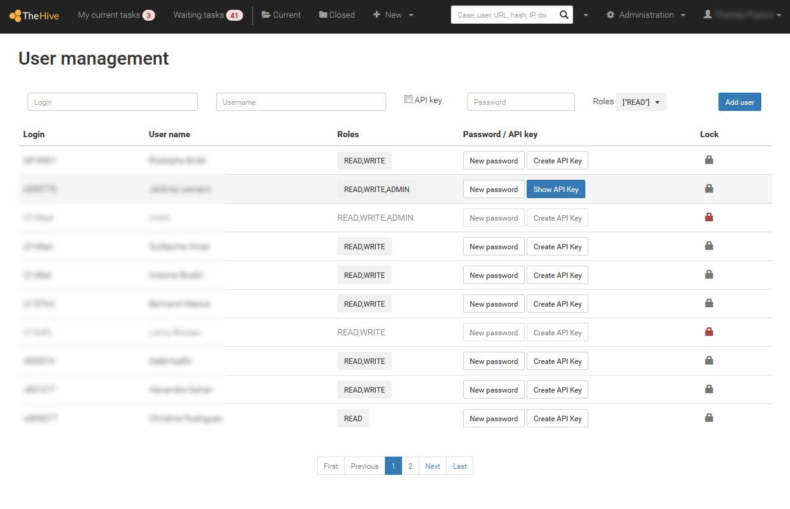
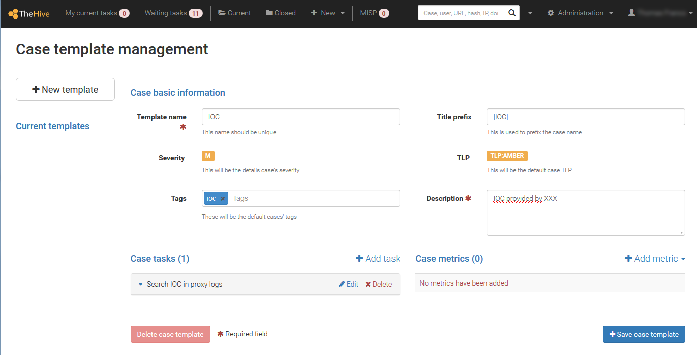
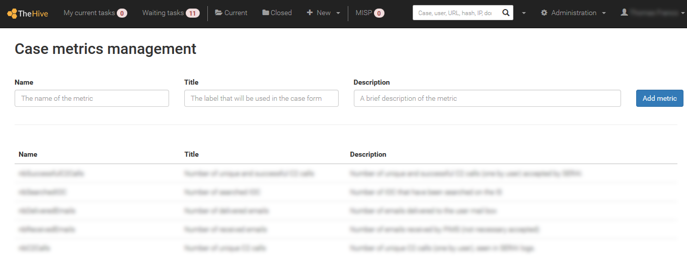
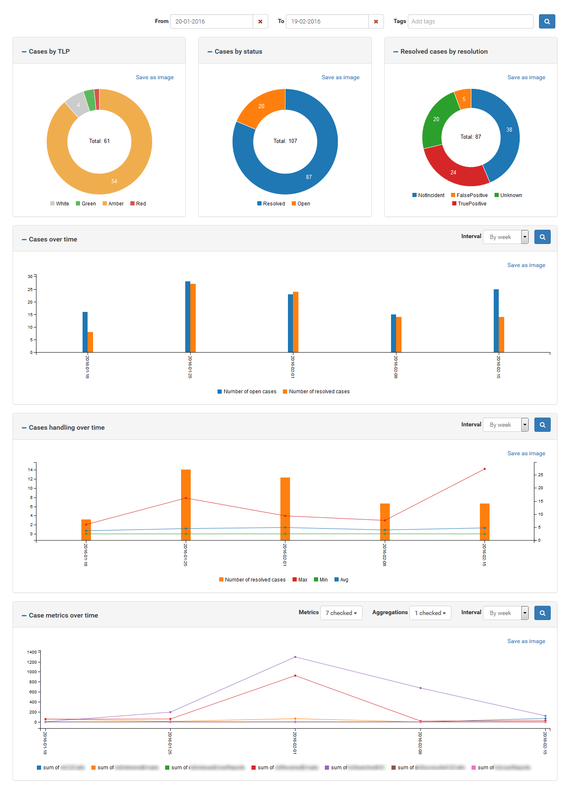

# Administrator's guide

## 1. User management

Users can be managed through the `Administration` > `Users` page. Only administrators may access it. Each user is identified by their login, full name and role.

Please note that you still need to create user accounts if you use LDAP or Active Directory authentication. This is necessary for TheHive to retrieve their role and authenticate them against the local database, LDAP and/or AD directories.

There are 3 roles currently:
 - `read` : all non-sensitive data can be read. With this role, a user can't make any change. They can't add a case, task, log or observable. They also can't run analyzers;
 - `write`: create, remove and change data of any type. This role is for standard users. `write` role inherits `read` rights;
 - `admin`: this role is reserved for TheHive administrators. Users with this role can manage user accounts, metrics, create case templates and observable data types. `admin` inherits `write` rights.

**Warning**: Please note that user accounts cannot be removed once they have been created, otherwise audit logs will refer to an unknown user. However, unwanted or unused accounts can be locked.

## 2. Case template management

Some cases may share the same structure (tags, tasks, description, metrics). Templates are here to automatically add tasks, description or metrics while creating a new case. An user can choose to create an empty case or based on registered template.

To create a template, as _admin_ go in the administration menu, and open the "Case templates" item.

In this screen, you can add, remove or change template.
A template contains:
 * default severity
 * default tags
 * title prefix (can be changed by user at case creation)
 * default TLP
 * default default
 * task list (title and description)
 * metrics

Except for title prefix, task list and metrics, the user can change values defined in template.

## 3. Report template management

When TheHive is connected to a Cortex server, observable can be analyzed to get additional information on them. Cortex outputs report in JSON format. In order to make reports more readable, you can configure report templates. Report templates convert JSON in to HTML using AngularJS template engine.

For each analyzer available in Cortex you can define two kinds of template: short and long. Short report exposes synthetic information, shows in top of observable page. With short reports you can see a sum-up of all run analyzes. Long report shows detail information only when the user select the report. Raw data in JSON format is always available.

Report templates can be configure in `Admin` > `Report templates` menu. We offer report templates for default Cortex analyzers. A package with all report templates can be downloaded at https://dl.bintray.com/cert-bdf/thehive/report-templates.zip and can be injected using the `Import templates` button.

## 4. Metrics management

Metrics have been integrated to have relevant indicators about cases.

Metrics are numerical values associated to cases (for example, the number of impacted users). Each metric has a _name_, a _title_ and a _description_, defined by an administrator. When a metric is added to a case, it can't be removed and must be filled. Metrics are used to monitor business indicators, thanks to graphs.

Metrics are defined globally. To create metrics, as _admin_ got in the administration menu, and open the "Case metrics" item.

Metrics are used to create statistics ("Statistics" item in the user profile menu). They can be filtered on time interval, and case with specific tags.

For example you can show metrics of case with "malspam" tag on January 2016 :

For graphs based on time, user can choose metrics to show. They are aggregated on interval of time (by day, week, month of year) using a function (sum, min or max).

Some metrics are predefined (in addition to those defined by administrator) like case handling duration (how much time the case had been open) and number of case opening or closing.
