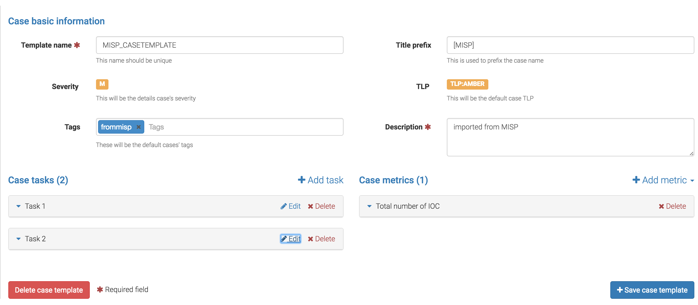

## Configuration file

The configuration file of TheHive is `/etc/thehive/application.conf` by default. This file uses the [HOCON format](https://github.com/typesafehub/config/blob/master/HOCON.md). All configuration parameters should go in this file.

You can have a look at the [default settings](Default-configuration).

### 1. Database

TheHive uses the Elasticsearch search engine to store all persistent data. Elasticsearch is not part of TheHive package. It must be installed and configured as a standalone instance which can be located on the same machine. For more information on how to set up Elasticsearch, please refer to [Elasticsearch installation guide](https://www.elastic.co/guide/en/Elasticsearch/reference/2.3/setup.html).

Three settings are required to connect to Elasticsearch:
 * the base name of the index
 * the name of the cluster
 * the address(es) and port(s) of the Elasticsearch instance

The Defaults settings are:

```
# Elasticsearch
search {
  # Name of the index
  index = the_hive
  # Name of the Elasticsearch cluster
  cluster = hive
  # Address of the Elasticsearch instance
  host = ["127.0.0.1:9300"]
  # Scroll keepalive
  keepalive = 1m
  # Size of the page for scroll
  pagesize = 50
}
```

If you use a different configuration, modify the parameters accordingly in the `application.conf` file.

If multiple Elasticsearch nodes are used as a cluster, addresses of the master nodes must be used for the `search.host` setting. All cluster nodes must use the same cluster name:

```
search {
    host = ["node1:9300", "node2:9300"]
   ...
```

TheHive uses the [`transport`](https://www.elastic.co/guide/en/Elasticsearch/reference/2.3/modules-transport.html#_tcp_transport) port (9300/tcp by default) and not the [`http`](https://www.elastic.co/guide/en/Elasticsearch/reference/current/modules-http.html) port (9200/tcp).

TheHive versions index schema (mapping) in Elasticsearch. Version number are appended to index base name (the 8th version of the schema uses the index `the_hive_8` if `search.index = the_hive`).

When too many documents are requested to TheHive, it uses the [scroll](https://www.elastic.co/guide/en/Elasticsearch/reference/2.3/search-request-scroll.html) feature: the results are retrieved through pagination. You can specify the size of the page (`search.pagesize`) and how long pages are kept in Elasticsearch ((`search.keepalive`) before purging.

### 2. Datastore

TheHive stores attachments as Elasticsearch documents. They are split in chunks and each chunk sent to Elasticsearch is identified by the hash of the entire attachment and the associated chunk number.

The chunk size (`datastore.chunksize`) can be changed but any change will only affect new attachments. Existing ones won't be changed.

An attachment is identified by its hash. The algorithm used is configurable (`datastore.hash.main`) but must not be changed after the first attachment insertion. Otherwise, previous files cannot be retrieved.

Extra hash algorithms can be configured using `datastore.hash.extra`. These hashes are not used to identify the attachment but are shown in the user interface (the hash associated to the main algorithm is also shown). If you change extra algorithms, you should inform TheHive and ask it to recompute all hashes. Please note that the associated API call is currently disabled in Buckfast (v 2.10). It will be reinstated in the next release.

Observables can contain malicious data. When you try to download an attachment from an observable (typically a file), it is automatically zipped and the resulting ZIP file is password-protected. The default password is **malware** but it can be changed with the `datastore.attachment.password` setting.

Default values are:

```
# Datastore
datastore {
  name = data
  # Size of stored data chunks
  chunksize = 50k
  hash {
    # Main hash algorithm /!\ Don't change this value
    main = "SHA-256"
    # Additional hash algorithms (used in attachments)
    extra = ["SHA-1", "MD5"]
  }
  attachment.password = "malware"
}
```

### 3. Authentication

TheHive supports local, LDAP and Active Directory (AD) for authentication. By default, it relies on local credentials stored in Elasticsearch.

Authentication methods are stored in the `auth.type` parameter, which is multi-valued. When an user logs in, each authentication method is tried in order until one succeeds. If no authentication method works, an error is returned and the user cannot log in.

The Default values within the configuration file are:
```
auth {
	# "type" parameter contains authentication provider. It can be multi-valued (useful for migration)
	# available auth types are:
	# services.LocalAuthSrv : passwords are stored in user entity (in Elasticsearch). No configuration are required.
	# ad : use ActiveDirectory to authenticate users. Configuration is under "auth.ad" key
	# ldap : use LDAP to authenticate users. Configuration is under "auth.ldap" key
	type = [local]

	ad {
		# Domain Windows name using DNS format. This parameter is required.
		#domainFQDN = "mydomain.local"

		# Domain Windows name using short format. This parameter is required.
		#domainName = "MYDOMAIN"

		# Use SSL to connect to domain controller
		#useSSL = true
	}

	ldap {
		# LDAP server name or address. Port can be specified (host:port). This parameter is required.
		#serverName = "ldap.mydomain.local:389"

		# Use SSL to connect to directory server
		#useSSL = true

		# Account to use to bind on LDAP server. This parameter is required.
		#bindDN = "cn=thehive,ou=services,dc=mydomain,dc=local"

		# Password of the binding account. This parameter is required.
		#bindPW = "***secret*password***"

		# Base DN to search users. This parameter is required.
		#baseDN = "ou=users,dc=mydomain,dc=local"

		# Filter to search user {0} is replaced by user name. This parameter is required.
		#filter = "(cn={0})"
	}
}

# Maximum time between two requests without requesting authentication
session {
  warning = 5m
  inactivity = 1h
}
```

To enable authentication using AD or LDAP, edit the `application.conf` file and supply the values for your environment. Then you need to create an account on TheHive for each AD or LDAP user in `Administration > Users` page (which can only be accessed by an administrator). This is required as TheHive needs to look up the role associated with the user and that role is stored locally by TheHive. Obviously, you don't need to supply a password as TheHive will check the credentials against the remote directory. 

In order to use SSL on LDAP or AD, TheHive must be able to validate remote certificates. To that end, the Java truststore must contain certificate authorities used to generate the AD and/or LDAP certificates. The Default JVM truststore contains the main official authorities but LDAP and AD certificates are probably not issued by them.

Use [keytool](https://docs.oracle.com/javase/8/docs/technotes/tools/unix/keytool.html) to create the truststore:
```
keytool -import -file /path/to/your/ca.cert -alias InternalCA -keystore /path/to/your/truststore.jks
```

Then add `-Djavax.net.ssl.trustStore=/path/to/your/truststore.jks` parameter when you start TheHive or put it in the `JAVA_OPTS` environment variable before starting TheHive.

### 4. Streaming (a.k.a The Flow)
The user interface is automatically updated when data is changed in the back-end. To do this, the back-end sends events to all the connected front-end.s The mechanism used to notify the front-end is called long polling and its settings are:

* `refresh` : when there is no notification, close the connection after this duration (the default is 1 minute).
* `cache` : before polling a session must be created, in order to make sure no event is lost between two polls. If there is no poll during the `cache` setting, the session is destroyed (the default is 15 minutes).
* `nextItemMaxWait`, `globalMaxWait` :  when an event occurs, it is not immediately sent to the front-ends. The back-end waits `nextItemMaxWait` and up to `globalMaxWait` in case another event can be included in the notification. This mechanism saves many HTTP requests.

Default values are:
```
# Streaming
stream.longpolling {
  # Maximum time a stream request waits for new element
  refresh = 1m
  # Lifetime of the stream session without request
  cache = 15m
  nextItemMaxWait = 500ms
  globalMaxWait = 1s
}
```

### 5. Entity size limit
The Play framework used by TheHive sets the HTTP body size limit to 100KB by default for textual content (json, xml, text, form data) and 10MB for file uploads. This could be too small in most cases so you may want to change it with the following settings in the `application.conf` file:

```
# Max textual content length
play.http.parser.maxMemoryBuffer=1M
# Max file size
play.http.parser.maxDiskBuffer=1G
```

*Note*: if you are using a NGINX reverse proxy in front of TheHive, be aware that it doesn't distinguish between text data and a file upload. So, you should also set the `client_max_body_size` parameter in your NGINX server configuration to the highest value among two: file upload and text size defined in TheHive `application.conf` file.

### 6. Cortex
TheHive can use one or several [Cortex](https://github.com/CERT-BDF/Cortex) analysis engines to get additional information on observables. When configured, analyzers available in Cortex become usable on TheHive. First you must enable `CortexConnector`, choose an identifier then specify the URL for each Cortex server:
```
## Enable the Cortex module
play.modules.enabled += connectors.cortex.CortexConnector

cortex {
  "CORTEX-SERVER-ID" {
    # URL of the Cortex server
    url = "<The_URL_of_the_CORTEX_Server_goes_here>"
  }
}
```

Cortex analyzes observables and outputs reports in JSON format. TheHive show the report as-is by default. In order to make reports more readable, we provide report templates which are in a separate package and must be installed manually:
 - download the report template package from https://dl.bintray.com/cert-bdf/thehive/report-templates.zip
 - log in TheHive using an administrator account
 - go to `Admin` > `Report templates` menu
 - click on `Import templates` button and select the downloaded package

### 7. MISP
TheHive has the ability to connect to one or several MISP servers. Within the configuration file, you can register your MISP server(s) under the `misp` configuration keyword. Each server shall be identified using an arbitrary name, its `url`, the corresponding authentication `key` and optional `tags` to add to the corresponding cases when importing MISP events.

#### 7.1 Minimal Configuration
To sync with a MISP server and retrieve events,  edit the `application.conf` file and adjust the example shown below to your setup:

```
## Enable the MISP module
play.modules.enabled += connectors.misp.MispConnector

misp {
  "MISP-SERVER-ID" {
    # URL of the MISP server
    url = "<The_URL_of_the_MISP_Server_goes_here>"
    # authentication key
    key = "<the_auth_key_goes_here>"
    # tags that must be automatically added to the case corresponding to the imported event
    tags = ["misp"]
  }

  # truststore to use to validate the MISP certificate (if the default truststore is not sufficient)
  #cert = /path/to/truststore.jsk

  # Interval between two MISP event import in hours (h) or minutes (m)
  interval = 1h
}
```

#### 7.2 Associate a Case Template to MISP Imports
As stated in the subsection above, TheHive is able to automatically import MISP events and create cases out of them. This operation leverages the template engine. Thus you'll need to create a case template prior to importing MISP events.

First, create a case template. Let's call it **MISP_CASETEMPLATE**.



Then update TheHive's configuration to add a 'caseTemplate' parameter as shown in the example below:

```
misp {
  "MISP-SERVER-ID" {
    # URL of the MISP server
    url = "<The_URL_of_the_MISP_Server_goes_here>"
    # authentication key
    key = "<the_auth_key_goes_here>"
    # tags that must be automatically added to the case corresponding to the imported event
    tags = ["misp"]
    # case template
    caseTemplate = "MISP_CASETEMPLATE"
  }

```

Once the configuration file has been edited, restart TheHive. Every new import of MISP event will generate a case according to the "MISP_CASETEMPLATE" template.

### 8. Monitoring and Performance Metrics

Performance metrics (response time, call rate to Elasticsearch and HTTP request, throughput, memory used...) can be collected if enabled in configuration.

Enable it by editing the `application.conf` file, and add:

```
# Register module for dependency injection
play.modules.enabled += connectors.metrics.MetricsModule

metrics.enabled = true
```

These metrics can optionally be sent to an external database (graphite, ganglia or influxdb) in order to monitor the health of the platform. This feature is disabled by default.

```
metrics {
    name = default
    enabled = true
    rateUnit = SECONDS
    durationUnit = SECONDS
    showSamples = false
    jvm = true
    logback = true

    graphite {
        enabled = false
        host = "127.0.0.1"
        port = 2003
        prefix = thehive
        rateUnit = SECONDS
        durationUnit = MILLISECONDS
        period = 10s
    }

    ganglia {
        enabled = false
        host = "127.0.0.1"
        port = 8649
        mode = UNICAST
        ttl = 1
        version = 3.1
        prefix = thehive
        rateUnit = SECONDS
        durationUnit = MILLISECONDS
        tmax = 60
        dmax = 0
        period = 10s
    }

    influx {
        enabled = false
        url = "http://127.0.0.1:8086"
        user = root
        password = root
        database = thehive
        retention = default
        consistency = ALL
        #tags = {
        #    tag1 = value1
        #    tag2 = value2
        #}
        period = 10s
    }
}
```
### 9. HTTPS
To enable HTTPS in the application, add the following lines to `/etc/thehive/application.conf`:
```
    https.port: 9443
    play.server.https.keyStore {
      path: "/path/to/keystore.jks"
      type: "JKS"
      password: "password_of_keystore"
    }
```
As HTTPS is enabled HTTP can be disabled by adding `http.port=disabled` in configuration.

To import your certificate in the keystore, depending on your situation, you can follow [Digital Ocean's tutorial](https://www.digitalocean.com/community/tutorials/java-keytool-essentials-working-with-java-keystores).

**More information**:
This is a setting of the Play framework that is documented on its website. Please refer to [https://www.playframework.com/documentation/2.5.x/ConfiguringHttps](https://www.playframework.com/documentation/2.5.x/ConfiguringHttps).
