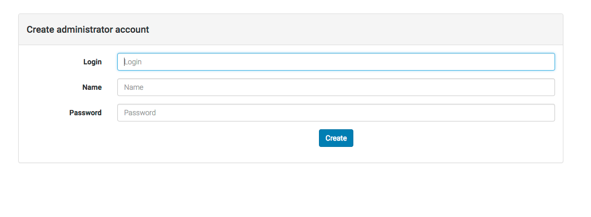
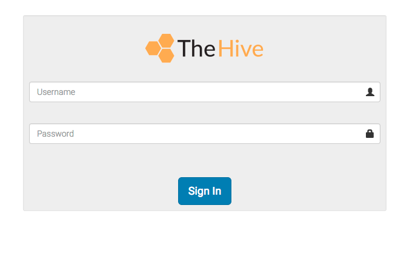

# Installation Guide for Ubuntu 16.04 LTS

This guide describes the manual installation of TheHive from binaries in Ubuntu 16.04. You can choose to install TheHive using:
 - [rpm package](rpm-installation-guide)
 - [deb package](deb-installation-guide)
 - [docker](docker-guide)
And you can also [build TheHive's source code](Build-Guide).

# 1. Minimal Ubuntu Installation

Install a minimal Ubuntu 16.04  system with the following software:
 * Java runtime environment 1.8+ (JRE)
 * ElasticSearch 2.x

Make sure your system is up-to-date:

```
sudo apt-get update
sudo apt-get upgrade
```

# 2. Install a Java Virtual Machine
You can install either Oracle Java or OpenJDK.

## 2.1. Oracle Java
```
echo 'deb http://ppa.launchpad.net/webupd8team/java/ubuntu trusty main' | sudo tee -a /etc/apt/sources.list.d/java.list
sudo apt-key adv --keyserver hkp://keyserver.ubuntu.com:80 --recv-key EEA14886
sudo apt-get update
sudo apt-get install oracle-java8-installer
```

Once Oracle Java is installed, go directly to section [3. Install and Prepare your Database](#3-install-and-prepare-your-database).

## 2.2 OpenJDK
```
sudo add-apt-repository ppa:openjdk-r/ppa
sudo apt-get update
sudo apt-get install openjdk-8-jre-headless

```

# 3. Install and Prepare your Database
ElasticSearch can be installed using system package or docker. The latter is preferred as its installation and update are easier.

## 3.1. Install ElasticSearch using system package
Install the ElasticSearch package provided by Elastic:
```
sudo apt-key adv --keyserver hkp://keyserver.ubuntu.com:80 --recv-key D88E42B4
echo "deb https://packages.elastic.co/elasticsearch/2.x/debian stable main" | sudo tee -a /etc/apt/sources.list.d/elasticsearch-2.x.list
sudo apt-get update && sudo apt-get install elasticsearch
```

The Debian package does not start up the service by default. The reason for this is to prevent the instance from accidentally joining a cluster, without being configured appropriately.

If you prefer using ElasticSearch inside a docker, see [3.2. ElasticSearch inside a Docker](#32-elasticsearch-inside-a-docker).

### ElasticSearch configuration

It is **highly recommended** to avoid exposing this service to an untrusted zone.

If ElasticSearch and TheHive run on the same host (and not in a docker), edit `/etc/elasticsearch/elasticsearch.yml` and set `network.host` parameter with `127.0.0.1`.
TheHive use dynamic scripts to make partial updates. Hence, they must be activated using `script.inline: on`.

The cluster name must also be set ("hive" for example).

Threadpool queue size must be set with a high value (100000). The default size will get the queue easily overloaded.

Edit `/etc/elasticsearch/elasticsearch.yml` and add the following lines:

```
network.host: 127.0.0.1
script.inline: on
cluster.name: hive
threadpool.index.queue_size: 100000
threadpool.search.queue_size: 100000
threadpool.bulk.queue_size: 1000
```

### Start the Service
Now that ElasticSearch is configured, start it as a service:
```
sudo systemctl enable elasticsearch.service
sudo service elasticsearch start
```

Note that by default, the database is stored in `/var/lib/elasticsearch`.

## 3.2. ElasticSearch inside a Docker

You can also start ElasticSearch inside a docker. Use the following command and do not forget to specify the absolute path for persistent data on your host :

```
docker run \
  --publish 127.0.0.1:9200:9200 \
  --publish 127.0.0.1:9300:9300 \
  --volume /absolute/path/to/persistent/data/:/usr/share/elasticsearch/data \
  --rm \
  elasticsearch:2 \
  -Des.script.inline=on \
  -Des.cluster.name=hive \
  -Des.threadpool.index.queue_size=100000 \
  -Des.threadpool.search.queue_size=100000 \
  -Des.threadpool.bulk.queue_size=1000
```

# 4. Install TheHive

Binary package can be downloaded at [thehive-latest.zip](https://dl.bintray.com/cert-bdf/thehive/thehive-latest.zip)

After configuring TheHive, if you use Cortex, don't forget to install [report templates](https://github.com/CERT-BDF/TheHive/wiki/Administrator's-guide#3-report-template-management).

## 4.1. Install from Binaries

Download and unzip the chosen binary package. TheHive files can be installed wherever you want on the filesystem. In this guide, we decided to set it in `/opt`.

```
cd /opt
wget https://dl.bintray.com/cert-bdf/thehive/thehive-latest.zip
unzip thehive-latest.zip
ln -s thehive-x.x.x thehive
```

### 4.2. Configuration

#### 4.2.1 Required configuration

Please refer the [configuration guide](Configuration) for full information on TheHive configuration.
The only required parameter in order to start TheHive is the key of the server (`play.crypto.secret`). This key is used to authenticate cookies that contain data. If TheHive runs in cluster mode, all instance must share the same key.
You can generate the minimal configuration with the following command lines (they assume that you have created a dedicated user for TheHive, named thehive):

```
sudo mkdir /etc/thehive
(cat << _EOF_
# Secret key
# ~~~~~
# The secret key is used to secure cryptographics functions.
# If you deploy your application to several instances be sure to use the same key!
play.crypto.secret="$(cat /dev/urandom | tr -dc 'a-zA-Z0-9' | fold -w 64 | head -n 1)"
_EOF_
) | sudo tee -a /etc/thehive/application.conf
```

Now you can start TheHive.

For advanced configuration, please, refer to the [configuration page](Configuration) and default configuration information you can find [here](Default-configuration). You will especially find all the necessary information to connect TheHive with Cortex and MISP.


### 4.3. First start

Change your current directory to TheHive installation directory (`/opt/thehive` in this guide), then execute:
```
bin/thehive -Dconfig.file=/etc/thehive/application.conf
```

It is recommended to use a dedicated non-privilege user to start TheHive. If so, make sure that your user can create log file in `/opt/thehive/logs`

This command starts an HTTP service on port 9000/tcp. You can change the port by adding "http.port=8080" in the configuration file or add the "-Dhttp.port=8080" parameter to the command line. If you run TheHive using a non-privileged user, you can't bind a port under 1024.


If you'd rather start the application as a service, do the following:
```
sudo addgroup thehive
sudo adduser --system thehive
sudo cp /opt/thehive/install/thehive.service /usr/lib/systemd/system
sudo chown -R thehive:thehive /opt/thehive
sudo chown thehive:thehive /etc/thehive/application.conf
sudo chmod 640 /etc/thehive/application.conf
sudo systemctl enable thehive
sudo service thehive start
```

Please note that the service may take some time to start.

Then open your browser and connect to http://YOUR_SERVER_ADDRESS:9000/

The first time you connect you will have to create the database schema. Click "Migrate database" to create the DB schema.


Once done, you should be redirected to the page for creating the administrator's account.



Once created, you should be redirected to the login page.



**Warning**: at this stage, if you missed the creation of the admin user, you will not be able to do it unless you delete the index in ElasticSearch. In the case you made a mistake, just delete the index with the following command (beware, it deletes everything in the database)
```
curl -X DELETE http://127.0.0.1:9200/the_hive_8
```

And reload the page or restart TheHive.

## 5. Update

To update TheHive from binaries, just stop the service, download the latest package, rebuild the link `/opt/thehive` and restart the service.

```
service thehive stop
cd /opt
wget https://dl.bintray.com/cert-bdf/thehive/thehive-latest.zip
unzip thehive-latest.zip
rm /opt/thehive && ln -s thehive-x.x.x thehive
chown -R thehive:thehive /opt/thehive /opt/thehive-x.x.x
service thehive start
```
